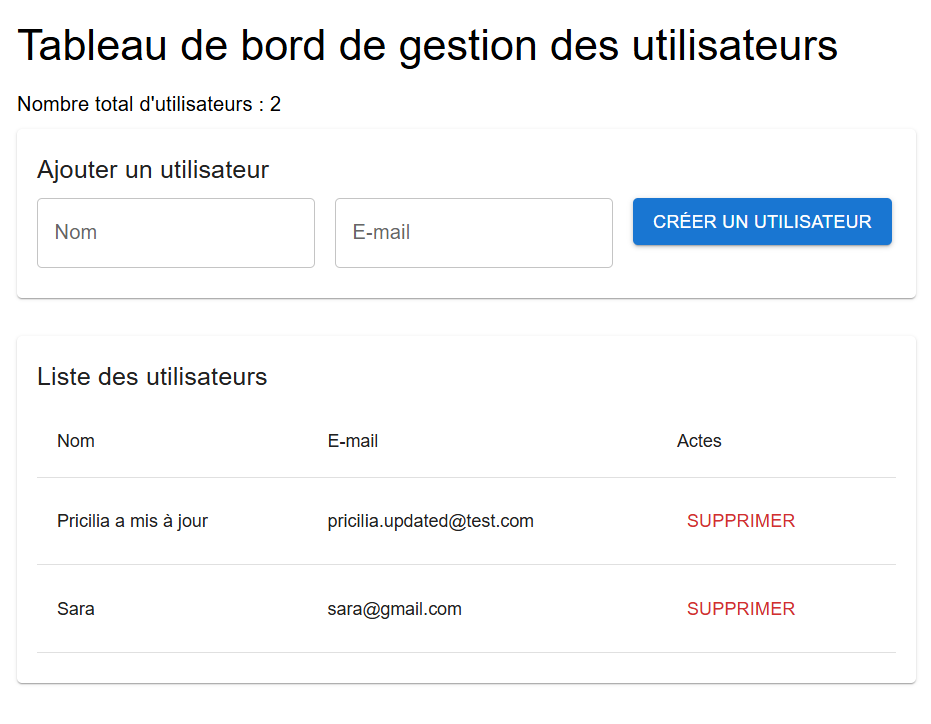
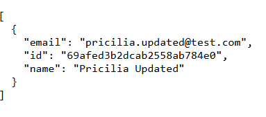
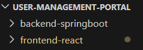

# User Management Portal

A full-stack user management application built with **React**, **Spring Boot**, and **MongoDB**.

This project demonstrates how to build a modern CRUD web application with a Java backend and a React frontend.

---

# Features

- Create a user
- Display all users
- Delete a user
- Update a user via API
- RESTful API with Spring Boot
- MongoDB database integration
- React user interface with Material UI

---

# Tech Stack

## Frontend
- React
- Material UI
- JavaScript
- Fetch API

## Backend
- Java
- Spring Boot
- Spring Data MongoDB

## Database
- MongoDB

## Tools
- Postman
- VS Code
- Git / GitHub

---

# Project Structure

```
user-management-portal
│
├── backend-springboot
│   └── user-management-api
│       └── src
│           └── main
│               └── java
│                   └── com.pricilia.usermanagement
│                       ├── controller
│                       ├── model
│                       ├── repository
│                       └── config
│
├── frontend-react
│   └── src
│       └── App.js
│
├── screenshots
│   ├── user-management-dashboard.png
│   ├── api-endpoint.png
│   └── project-structure.png
│
├── .gitignore
│
└── README.md


```

---

# Application Architecture

```
React Frontend
       ↓
Spring Boot REST API
       ↓
MongoDB Database
```

---

# Screenshots

## Application Dashboard



## API Endpoint Test (Postman)



## Project Structure



---

# API Endpoints

| Method | Endpoint | Description |
|------|------|------|
| GET | /users | Get all users |
| POST | /users | Create a user |
| PUT | /users/{id} | Update a user |
| DELETE | /users/{id} | Delete a user |

---

# Run the Project

## 1 Start MongoDB

```
mongod
```

---

## 2 Start Backend

```
cd backend-springboot/user-management-api/user-management-api
.\mvnw.cmd spring-boot:run
```

Server runs on:

```
http://localhost:9090
```

---

## 3 Start Frontend

```
cd frontend-react
npm start
```

Application runs on:

```
http://localhost:3000
```

---

# Example User JSON

```
{
  "name": "Sara",
  "email": "sara@gmail.com"
}
```

---

# Future Improvements

- Edit users directly from the React interface
- Authentication with Spring Security
- Deploy the application online
- Improve dashboard UI

---

# Author

Pricilia

---

# License

This project is for educational purposes.